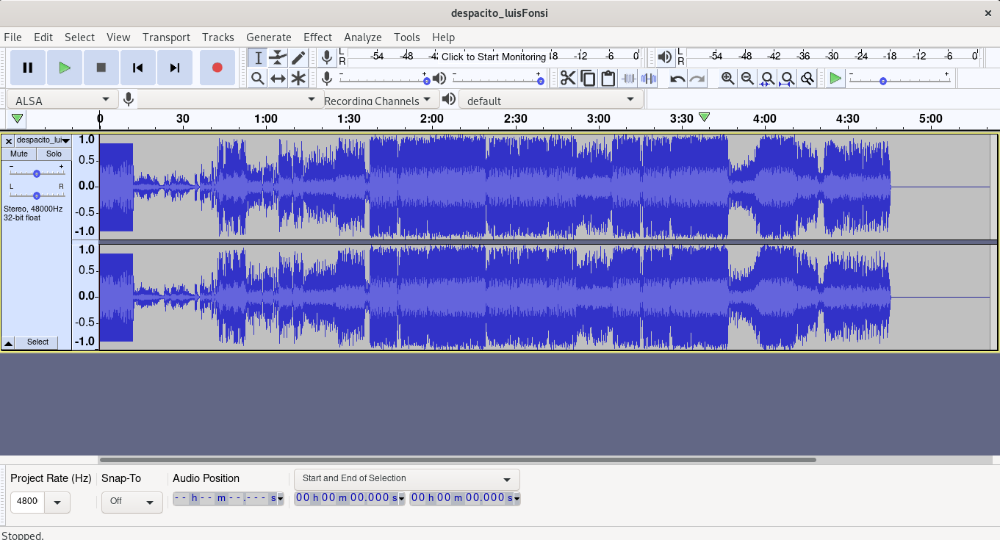
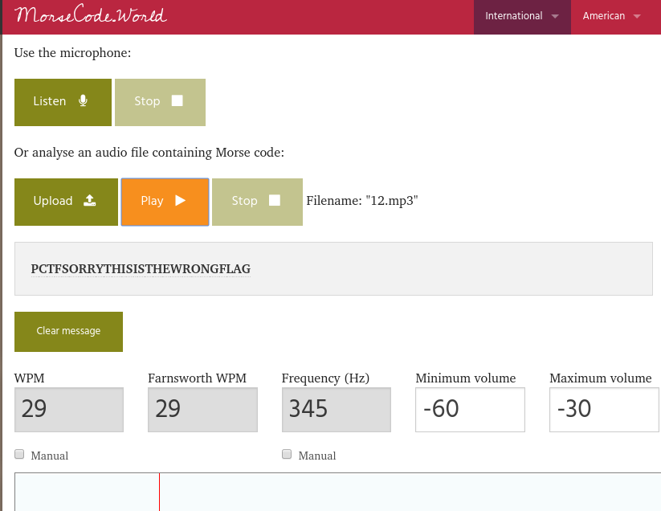
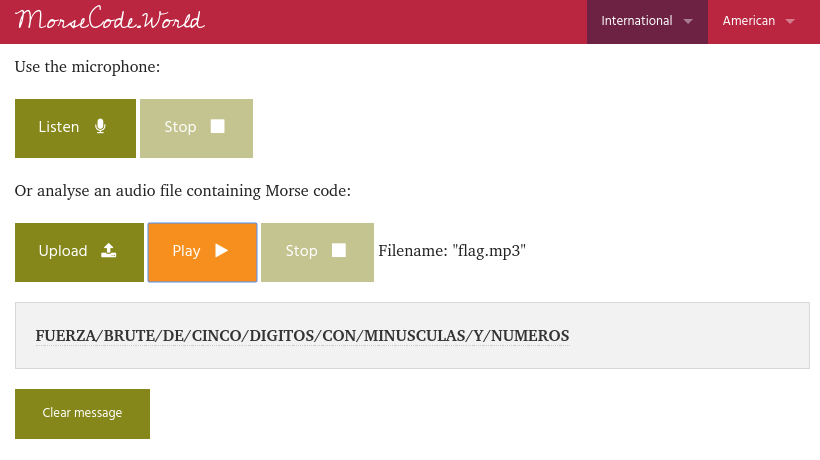
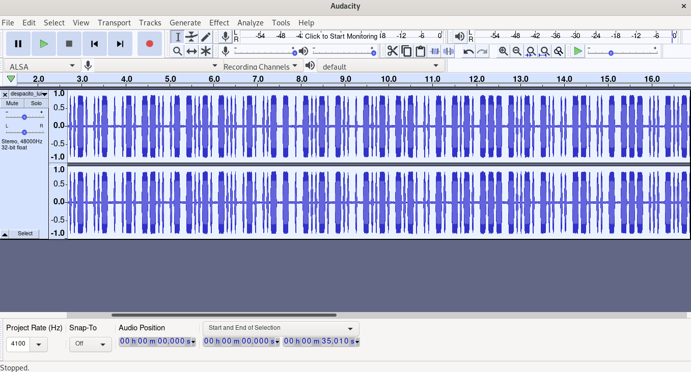
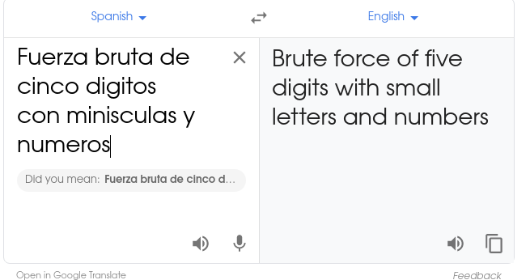
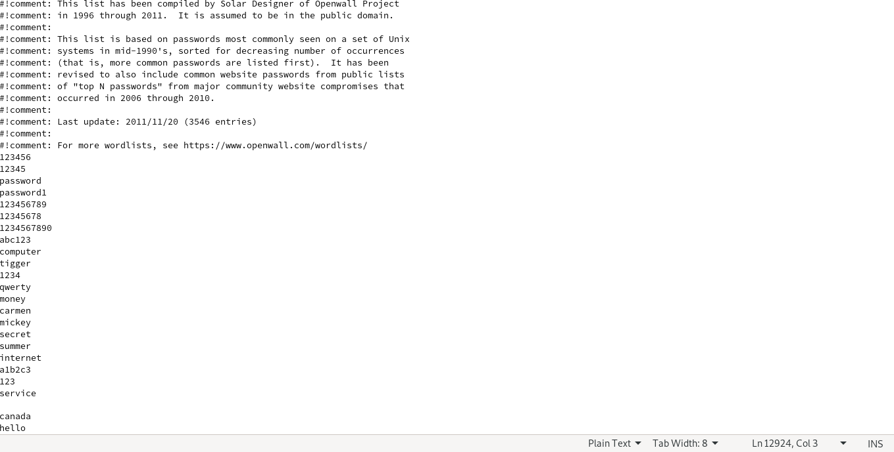
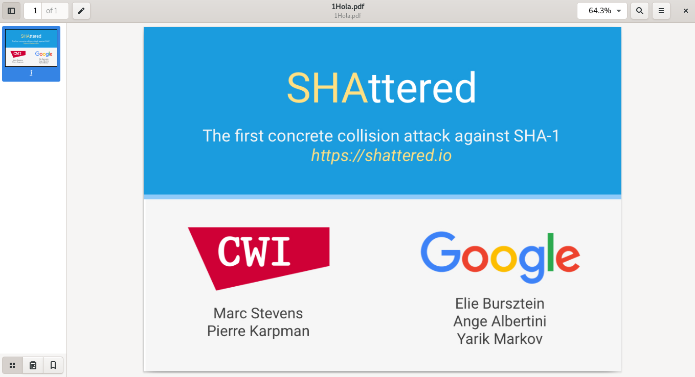
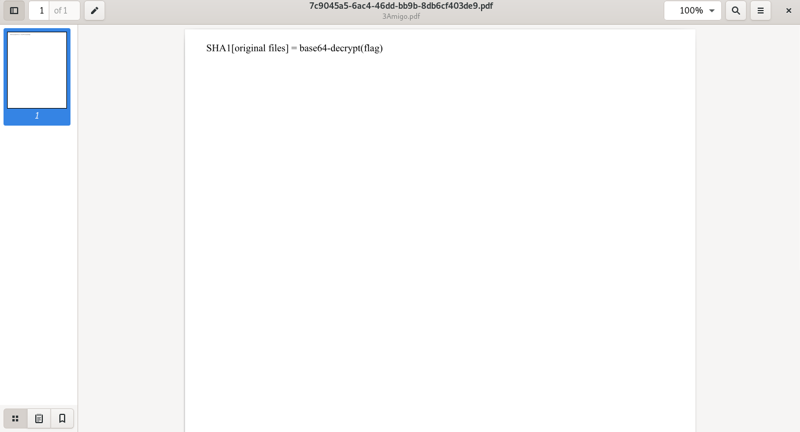

# Pragyan CTF 2020: Encuéntralo si puedes.


> Find and submit the p_ctf{flag}
>
> 

## Write-up
1. Extract the `main.zip` file and you will get 3 pdf and a audio file inside the main folder.

* Hola.pdf
* Mi.pdf
* Amigo.pdf
* despacito_luisFonsi.mp3

All the pdf files are password protected which can't be brute forced easily usinng `john the ripper`. Now you just have the audio file having some frequency and WPM values in it, which looks like a normal audio song "despacito".
But on playing we will find a long pause in the beginning of the audio. Use `audacity` to open it -




You will hear something in a very low voice, which on Amplifying give you a series of beep sounds, which indicates it as somme sort of morse code,
cut the beginning portion of the audio file and use some morse code translator extract the code.



This part on translation gives you a fake flag `PCTFSORRYTHISISTHEWRONGFLAG`, which is just a distraction. Now look at the end of the audio file, you will find another big pause here.

Amplify this part again and you will find another morse code inside it.



Cut the audio from the end and use morse code to text translator. 



It shows words separated by slashes (in other language). As we are using spanish from the beginning, try translating it from spanish to english after lowercasing them.



This gives you a hint `Brute force of five digits with small letters and numbers`, which can be used to open the pdf files now. But before that generate a word list containing series of strings of length 5 characters that can be formed using only lowercase letters and numbers that can be used by the john the ripper to brute force the passwords.
Append the wordlist inside the `password.lst` file.




Now use the tool to generate the hashes of the pdf files separately with the command 

```bash 
$ pdf2john Hola.pdf >> hola.hash
$ pdf2john Mi.pdf >> mi.hash
$ pdf2john Amigo.pdf >> amigo.hash

```
Now use the following command to generate the passwords of each file.

```bash
$ john hola.hash
$ john mi.hash
$ john amigo.hash

```

You got the passwords for each pdf files, `hola - x2n1z` `mi - 39adz` `amigo - 8yfa2`. Open these files.





Two of these files are the ones generated by google (shattered.io) which shows `SHA1 collision`, and the 3rd file has a line in it `SHA1[original files] = base64-decrypt(flag)`.
So clearly you need to find the original files and download them, and as both of them generate same sha1sum, use sha1sum over the pdf files you will get a code as both generate same SHA1 hashes `38762cf7f55934b34d179ae6a4c80cadccbb7f0a`.

```bash
$ sha1sum shattered-1.pdf
38762cf7f55934b34d179ae6a4c80cadccbb7f0a  shattered-1.pdf

```

Now use base64 encryption over the hash as mentioned and you will get the final code 

```bash
$ echo 38762cf7f55934b34d179ae6a4c80cadccbb7f0a | base64 
Mzg3NjJjZjdmNTU5MzRiMzRkMTc5YWU2YTRjODBjYWRjY2JiN2YwYQ==
```

The code you need is `Mzg3NjJjZjdmNTU5MzRiMzRkMTc5YWU2YTRjODBjYWRjY2JiN2YwYQ==`

So the final flag is `p_ctf{Mzg3NjJjZjdmNTU5MzRiMzRkMTc5YWU2YTRjODBjYWRjY2JiN2YwYQ==}`

