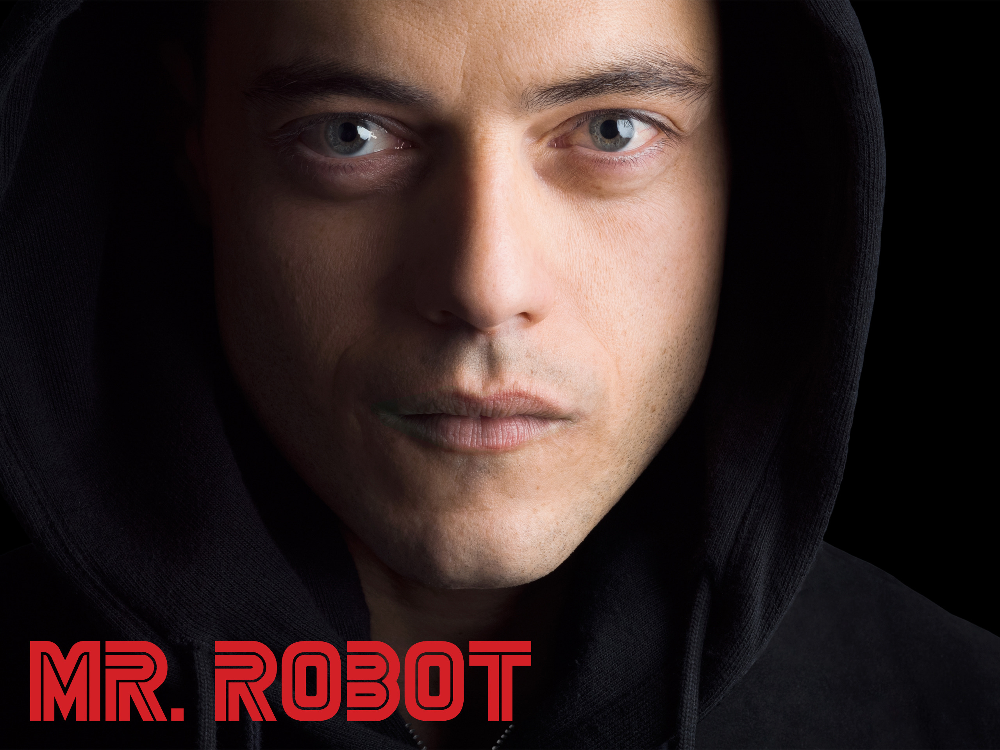

# Pragyan CTF 2020: Up can be Down.


> Find and submit the {flag}
>
> 

## Write-up
Given a simple file-

1. If we try to extract data from the image using `binwalk` and `steghide` we get our outputs as :
 
```bash
$ binwalk -e mrRobot.jpg 

DECIMAL       HEXADECIMAL     DESCRIPTION
--------------------------------------------------------------------------------
0             0x0             JPEG image data, JFIF standard 1.01
30            0x1E            TIFF image data, big-endian, offset of first image directory: 8

```
So it has hidden data but nothing is extracted so we do `steghide`
And we get-

```bash
$ steghide extract -sf  mrRobot.jpg
Enter passphrase:
```
So, we actually need a passphrase to do that.

2. Using `exiftool` on the file we get the following output:

```bash
$ exiftool mrRobot.jpg 
ExifTool Version Number         : 11.70
File Name                       : mrRobot.jpg
Directory                       : .
File Size                       : 857 kB
File Modification Date/Time     : 2020:01:08 21:33:25+05:30
File Access Date/Time           : 2020:01:08 21:35:41+05:30
File Inode Change Date/Time     : 2020:01:08 21:35:12+05:30
File Permissions                : rw-r--r--
File Type                       : JPEG
File Type Extension             : jpg
MIME Type                       : image/jpeg
JFIF Version                    : 1.01
Exif Byte Order                 : Big-endian (Motorola, MM)
X Resolution                    : 28
Y Resolution                    : 28
Resolution Unit                 : cm
Artist                          : 8f068b017cd807fd3b8c684dea2f8156
Y Cb Cr Positioning             : Centered
XMP Toolkit                     : Image::ExifTool 11.70
Format                          : U29tZSBTSEEgbWF5YmUhISEh
Comment                         : c82358dfb202ce9cfddc34e13d403fa3
Image Width                     : 2560
Image Height                    : 1920
Encoding Process                : Baseline DCT, Huffman coding
Bits Per Sample                 : 8
Color Components                : 3
Y Cb Cr Sub Sampling            : YCbCr4:4:4 (1 1)
Image Size                      : 2560x1920
Megapixels                      : 4.9

```
Now here we find a base64 value inside Format tag `U29tZSBTSEEgbWF5YmUhISEh`, which when decoded give `Some SHA maybe!!!!`,

Now we see 2 encrypted values in the Artist and Comment tags which are:

* Artist = 8f068b017cd807fd3b8c684dea2f8156
* Comment = c82358dfb202ce9cfddc34e13d403fa3

Now these are clearly encrypted. If we decrypt these using basic SHA256 Decryption , we get invalid output for both.
Now let's combine them and check again

* 8f068b017cd807fd3b8c684dea2f8156c82358dfb202ce9cfddc34e13d403fa3

Again it gives invalid answer
But as the question says "up can be down", just reverse the order and try-

* c82358dfb202ce9cfddc34e13d403fa38f068b017cd807fd3b8c684dea2f8156

Finally, we get a valid output "avium", which is the passphrase we needed.

3. So we use `steghide` to extract additional hidden data in the picture: with the obtained passphrase i.e., "avium", we get 


```bash
$ steghide extract -sf mrRobot.jpg
Enter Passphrase: avium
wrote extracted data to "flag.txt"
$ cat flag.txt
Congrats! This was way too easy :P

This is the key:

p_ctf{s0rry_6ut_1_@m_n0t_@_r060t}
```

The flag is `p_ctf{s0rry_6ut_1_@m_n0t_@_r060t}`.

